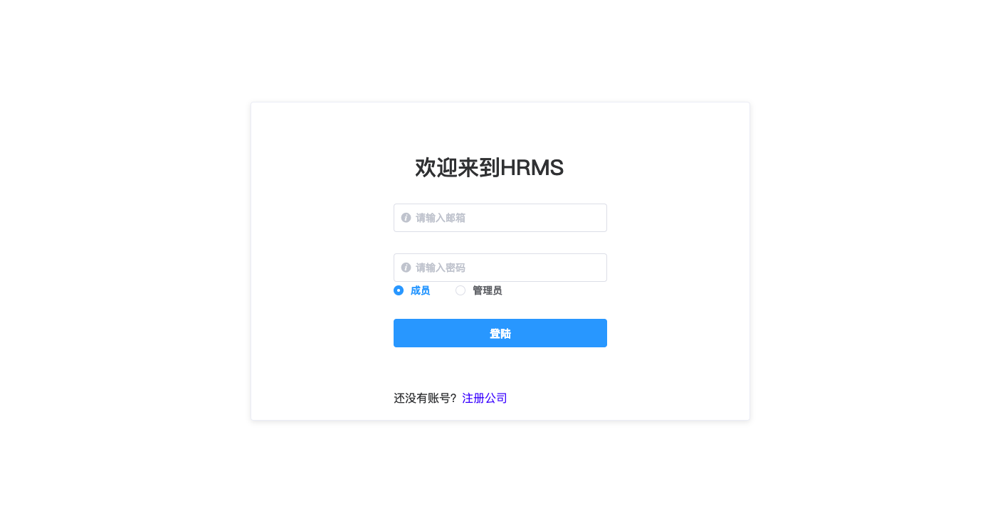

## 工程目的
基于web的人力资源管理
## 技术选型
    前端：vue
    服务器：nginx tomcat 
    框架：springmvc spring mybatis
    数据库：mysql
    cicd：teamcity nexus gitlab
    配置中心：携程apollo 
## 工程结构
Maven工程结构

```bash
mis-hrm
  └─mis-hrm-login 
  └─mis-hrm-member
  └─mis-hrm-book
  └─mis-hrm-project
  └─mis-hrm-index
  └─mis-hrm-manage
```
##模块说明
- mis-hrm-login 注册登录 
- mis-hrm-member 成员管理
- mis-hrm-book 图书管理
- mis-hrm-project 项目管理
- mis-hrm-index 管理系统主页
- mis-hrm-manage 权限设置

所有的工具类都写在mis-hrm-util。最好做成通用类
所有开发都在dev分支上开发
spring+springmvc+mybatis


##注意
1. 后端每天开发前必须先pull master 的代码。
2. 无论是修复bug还是添加功能 均创建一个新分支。命名格式 ddmmyy_操作_对象 如 150918_delete_druid
3. 当你的代码测试通过后，可以提交到master分支(提交前再次pull master分支的代码)。我会merge 你们的分支。 
4. 前端界面项目地址在https://github.com/dnf666/hrmshtml.git。

##前后端分离部署方法
### 前端部署
详见 https://github.com/dnf666/hrmshtml/blob/master/README.md
### 后端部署
1. 数据库创建数据库hrms，导入/sql/hrms.sql
2. 修改mis-hrm-member/src/main/resource/spring/jdbc.properties
3. 然后maven 打包war包。部署到tomcat的webapps目录下 tomcat的端口设置为8081。因为前端我设置的是访问8081端口

## ui图

